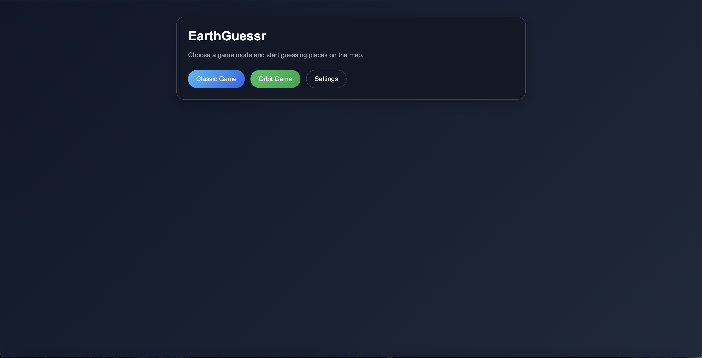
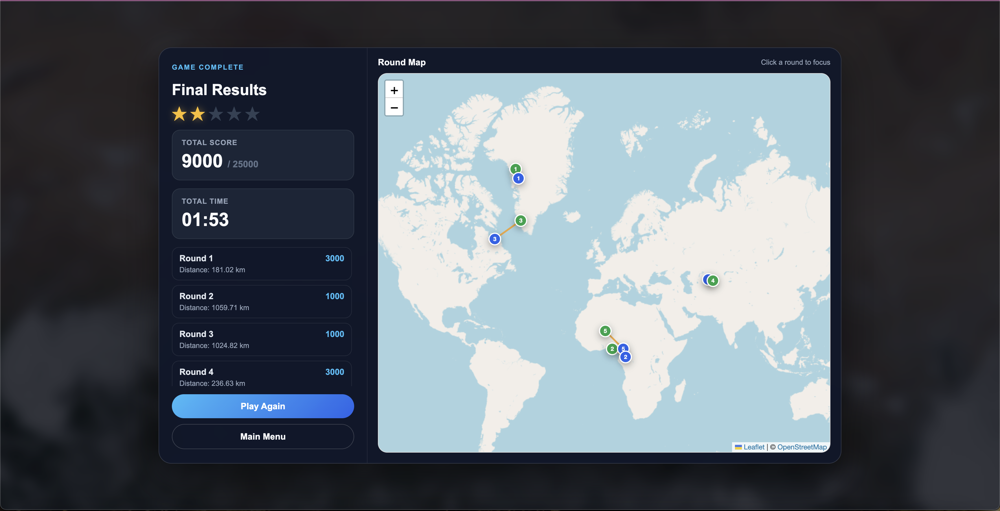

# EarthGuessr

> A satellite-image geolocation game inspired by GeoGuessr, built with FastAPI, Jinja2, Leaflet, and NASA imagery.

[](https://www.python.org/)
[](https://fastapi.tiangolo.com/)
[](https://leafletjs.com/)
[](https://www.docker.com/)

🇵🇱 [Polska wersja](README_pl.md)

EarthGuessr asks the player to identify a location from a real satellite image. The current playable mode, **Orbit Game**, uses NASA GIBS imagery and runs as a five-round session with an interactive world map, score calculation, and a final results view.

## Features

- Random land imagery from NASA GIBS WMS: MODIS Terra, MODIS Aqua, and VIIRS SNPP layers.
- Five-round Orbit Game with distance-based scoring.
- Leaflet and OpenStreetMap guessing map with one marker per round.
- Two optional, independently configurable hints:
  - **Circle Hint** — a 3,000 km area on the map.
  - **Scan** — terminal-style satellite and geographic metadata.
- Scan metadata: satellite, acquisition date, continent, ESA WorldCover surface class, elevation, approximate distance to coast, and hemisphere.
- Final results overlay with every guess, correct position, distance, score, and star rating.
- Docker support and a health-check endpoint.

## Technology

| Area | Tools |
| --- | --- |
| Backend | Python 3.12, FastAPI, Pydantic, Uvicorn |
| Frontend | Jinja2, vanilla JavaScript, custom CSS |
| Maps | Leaflet, OpenStreetMap |
| Satellite imagery | NASA GIBS WMS |
| Geographic data | Open-Meteo, Nominatim, ESA WorldCover, global-land-mask |
| Image handling | Pillow, Rasterio |
| Deployment | Docker and Docker Compose |

## Quick start

### Docker

```bash
docker compose up --build
```

Open [http://localhost:8000](http://localhost:8000).

Stop the application with:

```bash
docker compose down
```

### Local Python setup

Requires Python 3.12 or newer.

```bash
python -m venv .venv
source .venv/bin/activate
pip install -r requirements.txt
uvicorn app.main:app --reload
```

Open [http://localhost:8000](http://localhost:8000).

## How Orbit Game works

1. The server selects a random point on land and requests a satellite image from NASA GIBS.
2. The player places a marker on the world map and submits a guess.
3. The backend calculates the distance to the correct position and awards points.
4. After five rounds, the game displays a detailed results overlay.

The maximum session score is **25,000 points**.

| Distance from correct location | Score |
| --- | ---: |
| Under 100 km | 5,000 |
| Under 500 km | 3,000 |
| Under 2,000 km | 1,000 |
| 2,000 km or more | 0 |

## Hints

The Settings page controls the hint types independently. A player can enable the circle, Scan, both, or neither.

Each hint can be used once per round and becomes available again in the next round.

The Scan panel intentionally does not expose the answer coordinates. It shows contextual metadata instead.

## API

| Endpoint | Description |
| --- | --- |
| `GET /api/orbit/random` | Fetch a random satellite image and its metadata. |
| `POST /api/orbit/start` | Start or continue an Orbit Game round. |
| `POST /api/orbit/guess` | Submit a coordinate guess. |
| `GET /api/orbit/hint/{id}` | Get the Circle Hint. |
| `GET /api/orbit/hint/{id}/data` | Run the geographic Scan. |
| `GET /api/orbit/{id}/results` | Get final results after round five. |
| `GET /api/settings` | Read game settings. |
| `PUT /api/settings` | Update game settings. |

Interactive API documentation is available at [http://localhost:8000/docs](http://localhost:8000/docs) after starting the app.

## Project structure

```text
app/
├── routers/                 # FastAPI endpoints
├── schemas/                 # Pydantic request and response models
├── services/
│   ├── nasa_service.py      # NASA GIBS imagery requests
│   ├── hints_orbit_service.py
│   ├── geo_metadata_service.py
│   └── geo/                 # elevation, coast, continent, and land-cover providers
├── static/                  # CSS and JavaScript
└── templates/               # Jinja2 pages and partials
tests/                       # API and hint unit tests
```

## Screenshots

| Home screen | Orbit Game |
| --- | --- |
|  |  |

| Circle Hint | Geographic Scan |
| --- | --- |
|  |  |



## Testing

```bash
python -m pytest tests/ -q
```

## Notes

- NASA GIBS, OpenStreetMap, Open-Meteo, Nominatim, and ESA WorldCover require network access.
- ESA WorldCover is a land-cover product. Its `Bare / sparse vegetation / Desert` class is not a real-time observation for the date of a satellite image.

## Author

Rostik Chabanets · Portfolio project · 2026

For more detailed launch instructions, see [Launch_README_eng.md](Launch_README_eng.md).
